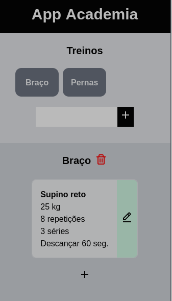

# App Academia
Um aplicativo simples para gerenciar seus treinos de boas, sem complicação.

<p>
    
</p>

## Quer um app desse também?

- Clone o projeto com os comando abaixo:
```
$ git clone git@github.com:mathefeitosa/app-academia-vue-tailwind.git

$ cd app-academia-vue-tailwind
```

- Logo após, instale todas as dependencias com:
```
$ npm i
```

### Para iniciar um servidor de desenvolvimento
```
$ npm run serve
```

### Compila todo o projeto para produção
```
$ npm run build
```

Documentações

- [Tailwind CSS](https://tailwindcss.com/)
- [Vue.js](https://br.vuejs.org/)
- [Boxicons](https://boxicons.com/)
- [Vue-Meta](https://www.npmjs.com/package/vue-meta)
- [Vuex](https://vuex.vuejs.org/ptbr/)
- [Firestore] (https://firebase.google.com/docs/)